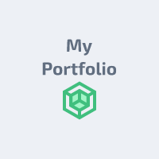

  
  
   

  <h3><b>My Portfolio: setup & mobile first</b><h3>

<!-- TABLE OF CONTENTS -->

# 📗 Table of Contents

- [📗 Table of Contents](#-table-of-contents)
- [📖 My Portfolio: setup \& mobile first ](#-my-portfolio-setup--mobile-first-)
  - [🛠 Built With HTML-CSS-\&-Node.js](#-built-with-html-css--nodejs)
    - [Tech Stack ](#tech-stack-)
    - [Key Features ](#key-features-)
  - [🚀 Live Demo ](#-live-demo-)
  - [💻 Getting Started ](#-getting-started-)
    - [Prerequisites ](#prerequisites-)
    - [Setup](#setup)
    - [Usage](#usage)
  - [👥 Author ](#-author-)
  - [🔭 Future Features ](#-future-features-)
  - [🤝 Contributing ](#-contributing-)
  - [⭐️ Show your support ](#️-show-your-support-)
  - [🙏 Acknowledgments ](#-acknowledgments-)
  - [📝 License ](#-license-)

<!-- PROJECT DESCRIPTION -->

# 📖 My Portfolio: setup & mobile first 

**[My Portfolio: setup & mobile first]** it's my second Microverse project done using HTML, CSS and understanding the GitHub flow, as well as good professional practices for creating branches, committing, a README.md file optimally for future projects as well as testing the configuration of linters like Webhint and Stylelint.

## 🛠 Built With HTML-CSS-&-Node.js

1- HTML.
2- CSS.
3- Node.js.
3- Linters.

### Tech Stack 

  <ul>
    <li><a href="[https://developer.mozilla.org/en-US/docs/Web/HTML]">HTML</a></li>
    <li><a href="[https://developer.mozilla.org/en-US/docs/Web/CSS])">CSS</a></li>
    <li><a href="[https://nodejs.org/en]">NODE.js</a></li>
  </ul>

<!-- Features -->
### Key Features 

- Added index.html file.
- Added style.css file.
- Added logo.

(<a href="#readme-top">back to top</a>)

## 🚀 Live Demo 

- Coming soon.

(<a href="#readme-top">back to top</a>)

<!-- GETTING STARTED -->

## 💻 Getting Started 

### Prerequisites 

In order to run this project you need:

- A code editor
- A web browser
- Basic knowledge of Git and GitHub

### Setup

To get a local copy up and running, follow these steps.

Clone this repository to your desired folder:

cd "my-folder"

git clone https://github.com/Otromascomotu/My-Portfolio-setup-and-mobile-first.git

### Usage

To run the project, execute the following command:

Open index.html using live server extension or manually.

(<a href="#readme-top">back to top</a>)

## 👥 Author 

👤 **Luis Laverde**

- GitHub: [@otromascomotu](https://github.com/otromascomotu)
- Twitter: [@otromascomotu](https://twitter.com/otromascomotu)
- LinkedIn: [/luis-laverde-developer](https://linkedin.com/in/luis-laverde-developer/)

(<a href="#readme-top">back to top</a>)

<!-- FUTURE FEATURES -->

## 🔭 Future Features 

- [ ] Add header.
- [ ] Add footer.
- [ ] Add more styles.

(<a href="#readme-top">back to top</a>)

<!-- CONTRIBUTING -->
## 🤝 Contributing 

Contributions, issues, and feature requests are welcome!

Feel free to check the [issues page](../../issues/).

(<a href="#readme-top">back to top</a>)

## ⭐️ Show your support 

If you like this project just give it a star ⭐.

(<a href="#readme-top">back to top</a>)

<!-- ACKNOWLEDGEMENTS -->

## 🙏 Acknowledgments 

I would like to thank to Microverse for giving me the opportunity to apply what I've learned and showing me the way to become a good programmer.

(<a href="#readme-top">back to top</a>)

<!-- LICENSE -->
## 📝 License 

This project is [MIT](./LICENSE) licensed.

(<a href="#readme-top">back to top</a>)

